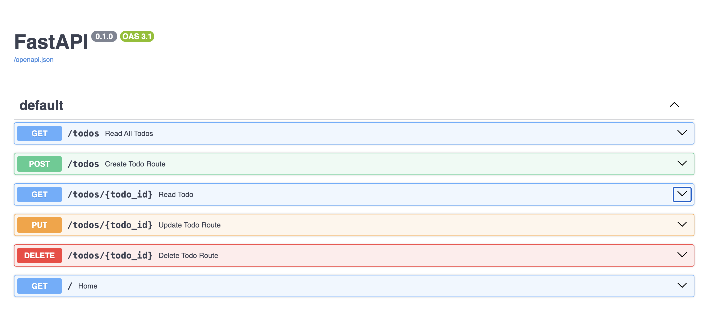

# Redis Read-Through Cache — Todo Application

A hands-on backend learning project built with Python, FastAPI, Redis, MongoDB, and Docker.

The goal of this project was not to build a production-ready application.  
It was created to understand how a basic backend evolves from an in-memory REST API into a database-backed, cache-enabled, containerized application.

The project focuses mainly on:

- REST API fundamentals
- backend layering
- database persistence
- Redis caching
- cache hits and misses
- TTL and stale data
- cache invalidation
- read-through caching
- Docker and Docker Compose
- communication between containers

---

## Project Overview

The application exposes a simple Todo API.

The final backend uses:

- **FastAPI** for the HTTP/API layer
- **MongoDB** as the persistent source of truth
- **Redis** as the cache
- **PyMongo** to communicate with MongoDB
- **redis-py** to communicate with Redis
- **Docker** to containerize the backend
- **Docker Compose** to run the complete system

The final architecture contains three running services:

```text
Client
  |
  v
FastAPI
  |
  v
Cache Service
  |
  v
ReadThroughCache
  |
  +-------------------+
  |                   |
  v                   v
Redis              MongoDB
Cache              Database
```

Redis handles frequently accessed data while MongoDB stores the persistent copy.

---

## Final Architecture


The application is split into multiple layers instead of keeping all logic inside the API routes.

```text
Client
  |
  v
FastAPI Route
  |
  v
Cache Service
  |
  v
ReadThroughCache
  |
  +------ Redis
  |
  +------ Repository
             |
             v
          MongoDB
```

This separation helped demonstrate how backend responsibilities can be divided into smaller components.

---

## API

The Todo resource supports the basic CRUD operations.

| Purpose | Method | Endpoint |
|---|---|---|
| Get all todos | GET | `/todos` |
| Get one todo | GET | `/todos/{todo_id}` |
| Create todo | POST | `/todos` |
| Update todo | PUT | `/todos/{todo_id}` |
| Delete todo | DELETE | `/todos/{todo_id}` |

FastAPI automatically generates interactive API documentation using Swagger UI.

### Swagger UI



Swagger is available locally at:

```text
http://localhost:8000/docs
```

---

## Tech Stack

| Technology | Purpose |
|---|---|
| Python | Backend programming |
| FastAPI | REST API framework |
| Pydantic | Request validation and data models |
| MongoDB | Persistent database |
| PyMongo | Python MongoDB driver |
| Redis | In-memory cache |
| redis-py | Python Redis client |
| Uvicorn | ASGI server for FastAPI |
| Docker | Application containerization |
| Docker Compose | Multi-container orchestration |

---

## Project Structure

```text
redis-read-through-cache/
├── backend/
│   ├── app/
│   │   ├── __init__.py
│   │   ├── main.py
│   │   ├── routes.py
│   │   ├── models.py
│   │   ├── schemas.py
│   │   ├── database.py
│   │   ├── repository.py
│   │   ├── redis_client.py
│   │   ├── cache_service.py
│   │   └── read_through_cache.py
│   ├── Dockerfile
│   └── requirements.txt
├── docs/
│   ├── architecture.png
│   └── swagger.png
├── docker-compose.yml
├── .gitignore
└── README.md
```

### Main responsibilities

`main.py`

Starts the FastAPI application and connects the router.

`routes.py`

Defines the HTTP endpoints.

`models.py`

Defines the Todo data model used by FastAPI and Pydantic.

`database.py`

Creates the MongoDB connection and exposes the Todo collection.

`repository.py`

Contains MongoDB CRUD operations.

This keeps database operations separate from the API layer.

`redis_client.py`

Creates the Redis client connection.

`cache_service.py`

Provides Todo-specific caching behavior.

`read_through_cache.py`

Contains the generic read-through cache abstraction.

It decides whether data should be returned from Redis or loaded from the backing database.

---

# Read-Through Cache

The main learning goal of this project was understanding read-through caching.

Conceptually:

```text
Application
    |
    v
Cache
    |
    +---- HIT ----> return cached data
    |
    +---- MISS
           |
           v
        Database
           |
           v
      store in cache
           |
           v
      return result
```

The important idea is that the caller asks the **cache abstraction** for the data.

The cache abstraction owns the miss-handling behavior.

In this project:

```text
GET /todos/2
      |
      v
cache_service.get_todo()
      |
      v
ReadThroughCache.get()
      |
      v
Redis GET todo:2
```

If Redis contains the value:

```text
CACHE HIT
    |
    v
Deserialize JSON
    |
    v
Return Todo
```

If Redis does not contain the value:

```text
CACHE MISS
    |
    v
loader()
    |
    v
repository.get_todo_by_id()
    |
    v
MongoDB
    |
    v
Serialize result to JSON
    |
    v
Redis SET + TTL
    |
    v
Return Todo
```

The route therefore does not directly contain logic such as:

```text
check Redis
if miss:
    check MongoDB
    write Redis
```

Instead it asks the cache abstraction:

```python
todo_cache.get(
    key=cache_key,
    loader=lambda: get_todo_by_id(todo_id)
)
```

The cache component decides whether the loader needs to run.

---

## Why a Python Read-Through Abstraction?

During the project, RedisGears was explored as one possible method for executing logic closer to Redis.

However, the project eventually used a Python abstraction instead.

The implementation therefore models read-through behavior at the application architecture level:

```text
FastAPI
   |
   v
ReadThroughCache
   |
   +-- Redis lookup
   |
   +-- loader() on cache miss
          |
          v
       MongoDB
```

Redis itself is still being used as the storage engine for cached values.

The Python `ReadThroughCache` class is responsible for coordinating the cache lookup and fallback behavior.

This made it possible to understand the caching pattern without depending on RedisGears.

---

# Cache Hit and Cache Miss

A **cache hit** occurs when the requested key already exists in Redis.

Example:

```text
GET todo:2
      |
      v
Redis contains todo:2
      |
      v
CACHE HIT
```

MongoDB is not queried.

A **cache miss** occurs when Redis does not contain the key.

```text
GET todo:2
      |
      v
Redis does not contain todo:2
      |
      v
CACHE MISS
      |
      v
MongoDB
```

The MongoDB result is then stored in Redis so future requests can become cache hits.

---

# Serialization

Redis does not directly store arbitrary Python dictionaries.

Before storing a Todo object in Redis, the dictionary is serialized into JSON.

```text
Python dict
    |
    v
json.dumps()
    |
    v
JSON string
    |
    v
Redis
```

When the cache is hit:

```text
Redis JSON string
    |
    v
json.loads()
    |
    v
Python dict
```

This also solved issues encountered when Python-specific values were passed directly to Redis.

---

# TTL — Time To Live

Cached data should not necessarily remain in Redis forever.

The project therefore stores cached Todos with a TTL.

Example:

```python
redis_client.set(
    key,
    json_data,
    ex=60
)
```

This gives the cached entry a lifetime of 60 seconds.

Redis can report the remaining lifetime using:

```bash
TTL todo:2
```

Possible result:

```text
(integer) 40
```

meaning the key has approximately 40 seconds remaining.

After expiration:

```bash
GET todo:2
```

returns:

```text
(nil)
```

The next API request becomes a cache miss and reloads the value from MongoDB.

---

# Stale Data and Cache Invalidation

TTL alone is not enough to keep cached data correct.

Consider:

```text
MongoDB:
todo:2.completed = true

Redis:
todo:2.completed = false
```

Redis now contains stale data.

Waiting for the TTL would eventually solve the problem, but until then users could receive outdated information.

Therefore the application also performs **cache invalidation**.

When a Todo is updated:

```text
PUT /todos/2
      |
      v
Update MongoDB
      |
      v
Delete todo:2 from Redis
```

When the Todo is requested again:

```text
GET /todos/2
      |
      v
CACHE MISS
      |
      v
MongoDB
      |
      v
Cache new value
```

The same principle applies when deleting a Todo.

```text
DELETE database record
        |
        v
DELETE cached key
```

TTL gives eventual cleanup.

Invalidation gives immediate cleanup after known writes.

---

# Read-Through Cache vs Cache-Aside

During this project, the Cache-Aside pattern was also studied because the two approaches are closely related.

Reference article:

[Redis: Cache Aside Pattern — Parottasalna](https://parottasalna.com/2024/06/09/redis-cache-aside-pattern/)

Both patterns usually produce the same high-level data flow:

```text
Cache Hit
---------
Request
   |
   v
Redis
   |
   v
Return data
```

and:

```text
Cache Miss
----------
Request
   |
   v
Redis
   |
   X
   |
   v
Database
   |
   v
Cache result
   |
   v
Return data
```

The important difference is **who owns the miss-handling logic**.

### Cache-Aside

The application explicitly handles the cache.

```text
Application
   |
   +--> check Redis
   |
   +--> if miss, query MongoDB
   |
   +--> write result into Redis
   |
   +--> return result
```

Pseudo-code:

```python
cached = redis.get(key)

if cached:
    return cached

data = database.get(id)

redis.set(key, data)

return data
```

The application knows every step.

### Read-Through

The caller asks a cache abstraction for the value.

```text
Application
   |
   v
Cache abstraction
   |
   +--> Redis
   |
   +--> loader on miss
            |
            v
         MongoDB
```

Pseudo-code:

```python
return cache.get(
    key,
    loader=lambda: database.get(id)
)
```

The cache abstraction owns the decision of when the backing store needs to be accessed.

### Comparison

| Cache-Aside | Read-Through |
|---|---|
| Application manages cache misses | Cache abstraction manages cache misses |
| Application queries database directly on miss | Loader/database access is hidden behind cache API |
| Cache logic can appear in application/service code | Cache logic is centralized |
| Application controls population explicitly | Cache abstraction controls population |
| Simple and very common | Useful for hiding repeated caching logic |

The implementation in this project is a **read-through-style application abstraction**.

Redis does not directly query MongoDB.

Instead, `ReadThroughCache` coordinates Redis and a MongoDB loader.

Studying cache-aside during this project helped make the architectural difference much clearer without needing a completely separate project.

---

# Redis Concepts Learned

Redis is an in-memory key-value data store.

Because Redis primarily stores data in memory, accessing cached data can avoid repeated database reads.

Important concepts explored during the project include:

### Redis Server

The Redis process that stores and serves cached data.

### Redis Client

The application or CLI that communicates with the Redis server.

Examples:

```text
redis-cli
redis-py
```

### Key

A unique identifier for a Redis value.

Example:

```text
todo:2
```

Using structured key names helps organize cached values.

### Redis Strings

Simple key-value storage.

```bash
SET message "Hello Redis"
GET message
```

### Redis Hashes

Field-value data stored under one Redis key.

```bash
HSET todo:1 title "Learn Redis"
HGETALL todo:1
```

### Delete

```bash
DEL todo:1
```

### TTL

```bash
TTL todo:1
```

Checks how many seconds remain before expiration.

### Expire

```bash
EXPIRE todo:1 60
```

Adds an expiry time to an existing key.

---

# MongoDB Concepts Learned

The project originally used Python lists and dictionaries as temporary application state.

That helped demonstrate a limitation:

```text
Application stops
      |
      v
In-memory state disappears
```

A real backend needs persistent storage.

MongoDB was introduced as the permanent database.

MongoDB is a document-oriented NoSQL database.

The project uses:

```text
todo_db
   |
   v
todos collection
   |
   v
Todo documents
```

Example Todo:

```json
{
  "id": 2,
  "title": "Learn Redis",
  "description": "Understand caching",
  "completed": false
}
```

PyMongo provides the Python API used to communicate with MongoDB.

---

# Repository Pattern

Database operations are kept inside `repository.py`.

Instead of routes directly calling MongoDB:

```text
Route
   |
   v
MongoDB
```

the structure becomes:

```text
Route
   |
   v
Repository
   |
   v
MongoDB
```

This separates HTTP responsibilities from database responsibilities.

Typical repository functions include:

```text
get_all_todos()
get_todo_by_id()
create_todo()
update_todo()
delete_todo()
```

This made the MongoDB layer easier to understand independently from FastAPI.

---

# Docker

Docker was introduced after the API and caching fundamentals were understood manually.

A **Docker image** is the packaged blueprint used to create containers.

A **container** is a running isolated environment created from an image.

The project first tested Docker using:

```bash
docker run hello-world
```

The basic process is:

```text
docker run
    |
    v
Check local images
    |
    +--> image exists -> use image
    |
    +--> image missing
            |
            v
       Docker Hub
            |
            v
       Download image
            |
            v
       Create container
            |
            v
       Run application
```

---

## Dockerizing FastAPI

The backend is packaged using a Dockerfile.

Conceptually the container contains:

```text
Docker Container
|
├── Python
├── FastAPI
├── Uvicorn
├── dependencies
└── app/
    ├── main.py
    ├── routes.py
    ├── repository.py
    ├── cache_service.py
    ├── redis_client.py
    └── read_through_cache.py
```

Port `8000` is exposed so the browser can reach FastAPI.

---

# Docker Compose

Docker Compose is used to start the complete learning environment.

The final system contains:

```text
Docker Compose Network
|
├── backend
│     FastAPI
|
├── redis
│     Redis cache
|
└── mongo
      MongoDB database
```

Docker Compose also provides service discovery.

Instead of hardcoding container IP addresses, containers can communicate using service names.

Conceptually:

```text
backend
   |
   +--> redis:6379
   |
   +--> mongo:27017
```

This was an important part of understanding container networking.

---

# Useful Docker Commands

| Command | Meaning |
|---|---|
| `docker images` | List Docker images |
| `docker ps` | Show running containers |
| `docker ps -a` | Show all containers |
| `docker run` | Create and start a container |
| `docker start` | Start an existing container |
| `docker stop` | Stop a container |
| `docker rm` | Delete a container |
| `docker rmi` | Delete an image |
| `docker pull` | Download an image |

Useful Compose commands:

```bash
docker compose up
docker compose up --build
docker compose up -d --build
docker compose down
docker compose ps
docker compose logs backend
docker compose logs -f backend
```

---

# Getting Started

## Prerequisites

Install:

- Git
- Docker Desktop
- Docker Compose

No local Redis or MongoDB installation is required when running through Docker Compose.

---

## 1. Clone the Repository

```bash
git clone https://github.com/Sree-2607/redis-read-through-cache.git
cd redis-read-through-cache
```

---

## 2. Start the Application

Make sure Docker Desktop is running.

```bash
docker compose up --build
```

or run it in the background:

```bash
docker compose up -d --build
```

Docker Compose starts:

```text
FastAPI
Redis
MongoDB
```

---

## 3. Open Swagger UI

Open:

```text
http://localhost:8000/docs
```

The API can be tested interactively from the browser.

---

## 4. Observe Cache Behavior

Watch backend logs:

```bash
docker compose logs -f backend
```

Request a Todo:

```http
GET /todos/2
```

If the cache is empty:

```text
CACHE MISS
```

The value is loaded from MongoDB and cached.

Request the same Todo again:

```text
CACHE HIT
```

The value is now returned from Redis.

---

## 5. Inspect Redis

Open the Redis CLI:

```bash
docker compose exec redis redis-cli
```

Inspect a cached Todo:

```bash
GET todo:2
```

Check its TTL:

```bash
TTL todo:2
```

Clear cached data:

```bash
FLUSHALL
```

---

## 6. Stop the Application

```bash
docker compose down
```

---
# Main Concepts Learned

By completing this project, the following backend concepts were explored:

- REST APIs
- HTTP methods
- path parameters
- Pydantic validation
- FastAPI routing
- Swagger/OpenAPI
- CRUD operations
- application state
- persistent databases
- MongoDB documents
- PyMongo
- repository pattern
- Redis clients and servers
- Redis strings and hashes
- cache keys
- key naming conventions
- cache hits
- cache misses
- serialization and deserialization
- TTL
- stale data
- cache invalidation
- read-through caching
- cache-aside caching
- Docker images
- Docker containers
- Dockerfiles
- Docker Compose
- container networking
- service discovery

---

# Key Takeaway

The project started as a basic API:

```text
Client
   |
   v
FastAPI
   |
   v
Python memory
```

It evolved into:

```text
Client
   |
   v
FastAPI
   |
   v
ReadThroughCache
   |
   +-------- Redis
   |
   +-------- Repository
                |
                v
             MongoDB
```

and finally all components were run together using Docker Compose:

```text
Docker Compose
|
├── FastAPI container
├── Redis container
└── MongoDB container
```

The most important lesson from the project is that caching is not simply "put Redis in front of a database."

A caching system must answer several questions:

```text
Where is the source of truth?
When should the database be queried?
Who handles a cache miss?
How long should cached data live?
What happens when the database changes?
How is stale cache data removed?
Who owns the caching logic?
```

This project used MongoDB as the source of truth, Redis as the temporary fast-access layer, TTL for automatic expiration, invalidation after writes, and a Python `ReadThroughCache` abstraction to own cache-miss handling.

That completes the learning implementation of a Redis-backed read-through cache.
