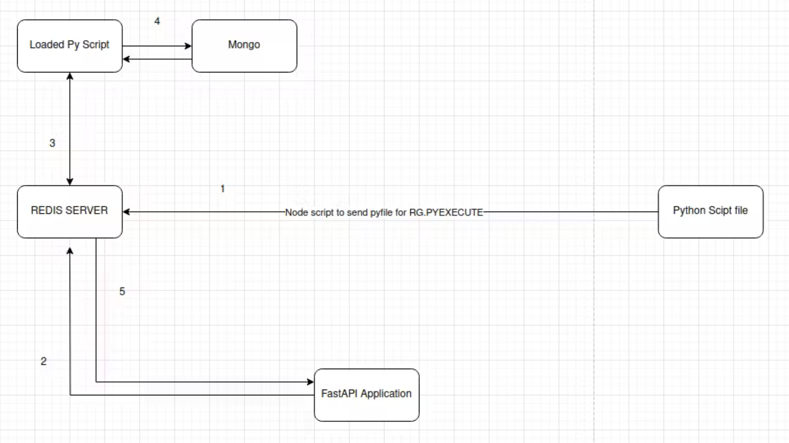

# Redis Read-Through Cache — Todo Application

A hands-on backend learning project using Python, FastAPI, Redis, MongoDB and Docker.

The goal is to understand how a basic REST API evolves into a cache-enabled backend application.

## Project Overview

This project implements a Todo API and gradually introduces caching, database persistence and containerization.

The current implementation uses:
- FastAPI to handle HTTP requests.
- Redis for caching frequently accessed data.
- A Python dictionary as a simulated database.
- Docker Compose to run FastAPI and Redis in separate containers.

MongoDB integration is planned for the next milestone.

## Tech Stack

| Technology | Purpose |
|---|---|
| Python | Backend programming |
| FastAPI | REST API development |
| Pydantic | Data validation |
| Redis | In-memory caching |
| Docker | Application containerization |
| Docker Compose | Multi-container orchestration |
| MongoDB | Persistent database (planned) |

## Architecture



The diagram represents the intended final architecture. The current implementation uses a simulated database instead of MongoDB.

### Current Application Flow

1. The client requests a Todo through FastAPI.
2. The cache service checks Redis.
3. If the data exists, Redis returns the cached value.
4. If the data is missing, the application retrieves it from the simulated database.
5. The application stores the result in Redis and returns it.

## Project Structure

```text
redis-read-through-cache/
├── backend/
│   ├── app/
│   │   ├── __init__.py
│   │   ├── main.py
│   │   ├── routes.py
│   │   ├── models.py
│   │   ├── schemas.py
│   │   ├── database.py
│   │   ├── repository.py
│   │   ├── redis_client.py
│   │   └── cache_service.py
│   ├── Dockerfile
│   └── requirements.txt
├── docs/
│   └── architecture.png
├── docker-compose.yml
├── .gitignore
└── README.md
```

## Getting Started

### Prerequisites

- Git
- Docker Desktop
- Docker Compose

### 1. Clone the Repository

```bash
git clone https://github.com/Sree-2607/redis-read-through-cache.git
cd redis-read-through-cache
```

### 2. Start the Application

Make sure Docker Desktop is running.

```bash
docker compose up --build
```

This builds the FastAPI image and starts the FastAPI and Redis containers.

### 3. Open Swagger UI

Visit:

http://localhost:8000/docs

### 4. Test the Cache

Execute:

```http
GET /todos/1
```

On the first request with an empty cache, the application should print:

```text
CACHE MISS
```

On subsequent requests, it should print:

```text
CACHE HIT
```

### 5. Stop the Application

```bash
docker compose down
```

## Learning Milestones

### Milestone 1 — FastAPI Fundamentals
- [x] Set up the Python project.
- [x] Create a FastAPI application.
- [x] Implement basic Todo CRUD operations.
- [x] Learn Pydantic models and API validation.
- [x] Understand routers and backend structure.

### Milestone 2 — Redis Manually
- [x] Install Redis.
- [x] Learn Redis CLI commands.
- [x] Explore Redis strings and hashes.
- [x] Connect Redis with Python.
- [x] Perform Redis CRUD operations.
- [x] Understand TTL and expiration.
- [x] Implement a cache hit/miss simulation.
- [x] Connect the cache service to FastAPI.

### Milestone 3 — Docker
- [x] Learn Docker fundamentals.
- [x] Run the first Docker container.
- [x] Create a Dockerfile for FastAPI.
- [x] Build and run the FastAPI image.
- [x] Configure Redis using environment variables.
- [x] Set up Docker Compose.
- [x] Run FastAPI and Redis in separate containers.

### Milestone 4 — Read-Through Cache
- [ ] Set up MongoDB.
- [ ] Connect FastAPI to MongoDB.
- [ ] Implement MongoDB-backed Todo operations.
- [ ] Integrate Redis with MongoDB.
- [ ] Implement cache invalidation.
- [ ] Test cache hits, misses and expiration.

### Milestone 5 — Production Improvements
- [ ] Improve environment configuration and security.
- [ ] Add automated tests.
- [ ] Improve error handling.
- [ ] Measure caching performance.
- [ ] Improve logging and monitoring.

## Learning Goals

- Understand REST API development.
- Learn Python backend architecture.
- Understand Redis caching.
- Explore cache hits, misses and expiration.
- Learn database persistence.
- Understand Docker and container networking.
- Apply caching and system design concepts.
